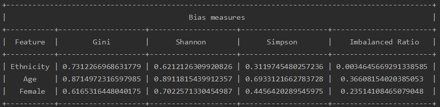

# Bias and Fairness Detector

<p align="center">
  
</p>

One of the biggest challenges in Machine Learning is dealing with biased datasets. Having autonomous decision making systems (ADM) trained with biased datasets might have strong negative consequences on their lives (see for example the [Compass case](https://www.propublica.org/article/how-we-analyzed-the-compas-recidivism-algorithm)).

In this repository I provided an easy way for measuring the bias of your datasets. There are several biases measures, these are the ones that I have implemented:
* Gini Simpson diversity index
* Shannon diversity index
* Inverse Simpson diversity index
* Imabalance ratio

All these index will be in the range [0,1], and by construction, the higher their values will be, the "better" will be the dataset. 

Reference : 
* https://en.wikipedia.org/wiki/Diversity_index

## How can you run it?
Once you clone the repository, you can run the script with the default dataset and settings:
```
python main.py
```

The default [dataset](https://www.kaggle.com/danofer/compass) is the one used for the Compass case. You can add the following options:
* --dataset \<directory of the dataset\>
* --sensitive_attr \<list of sensitive attributes that you want to analyze\>

For example: 
```
python main.py --dataset 'data/propublica_data_cleaned.csv' --sensitive_attr Ethnicity Age Female
```

The result will be: 
<p align="center">
  
</p>  


## Do you want to contribute?

1. Fork the repository
2. Do the desired changes
3. Make a pull request

Et voila! 


## What's next?
In my to do list you can find at the moment:
* streamlit interactive dashboard
* implementation of fairness measures


## Do you want to reach me out? 
* [](https://www.linkedin.com/in/francescodisalvo-pa/)
* [`francesco.disalvo99@gmail.com`](mailto:francesco.disalvo99@gmail.com)
